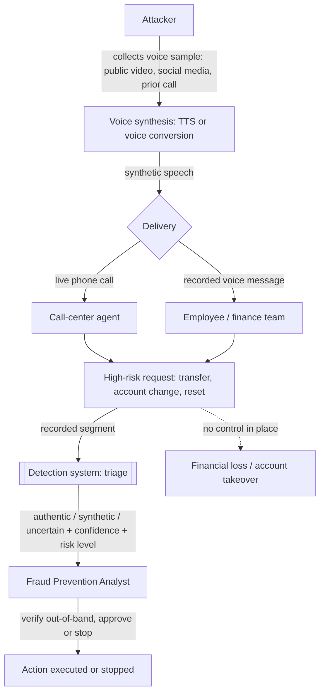

# Threat Model — Voice-Spoofing Detection for Fraud Prevention

| Field | Value |
|---|---|
| Status | **v1.0 — reviewed** (Stage 2 gate; see §14) |
| Stage / branch | Stage 2 · `stage-2-threat-model` |
| Authors | Donia Mabrouk, Iheb Zemzemi, Malak Ben Salem |
| Inputs | Proposal §2 (threat figure, attacker assumptions), SRS v3.0 (§1.2 scope, NFRs, WH-01–04), SDD v1.0, `docs/dataset_audit.md`, `docs/decisions.md` |

Evidence labels: **[verified]** checked on our data · **[doc]** from documentation or published reporting · **[hypothesis]** not yet tested · **[decision]** approved team decision.

---

## 1. Purpose and scope

This document states **who attacks, how, what they want, and where our system intervenes**, and maps each threat to the experiment that tests it. It is the reference for what the project may and may not claim.

The system is a **decision-support control**: it estimates whether a recorded speech segment is synthetic and flags it for human review. It is not a biometric authenticator, it does not detect fraud by itself, and it does not protect against every voice-cloning method (SRS §1.2, NFR-05). A "synthetic" output means *this recording deserves more scrutiny*; an "authentic" output does **not** prove the request is legitimate.

---

## 2. Real-world grounding [doc]

Two publicly reported incidents illustrate the two attack paths this project addresses:

- **Executive impersonation (2019).** The CEO of a UK energy company transferred €220,000 after a phone call in which an AI-generated voice imitated the chief executive of the German parent company. The case was reported by the Wall Street Journal, based on the insurer Euler Hermes. ([report](https://www.bitdefender.com/blog/hotforsecurity/ceo-voice-deepfake-blamed-for-scam-that-stole-243000/))
- **Voice-verification bypass (2023).** A Vice journalist accessed his own Lloyds Bank account through the bank's phone Voice ID, using a clone of his voice made with a commercial voice-AI service from about five minutes of recorded speech. ([Vice](https://www.vice.com/en/article/dy7axa/how-i-broke-into-a-bank-account-with-an-ai-generated-voice) · [AI Incident Database #485](https://incidentdatabase.ai/cite/485/))

These are cited as motivation only. Our experiments do not reproduce or evaluate these specific attacks.

---

## 3. Deployment scenario and detection point

### 3.1 Primary scenario — call-center triage of high-risk requests [decision]

A bank's call center receives a phone request that would cause harm if fraudulent: a large transfer, a change of registered phone number, or a credential reset. **Only these high-risk requests** are routed to the system. The recorded segment of the call is submitted (dashboard or API), and a **Fraud Prevention Analyst** reviews the result **before the action is executed**.

### 3.2 Secondary scenario — executive impersonation via voice message [decision]

An employee in a finance team receives a **recorded voice message** (e.g., a messaging-app voice note) that appears to come from a senior executive and requests an urgent payment. The message is a file by nature, so it fits a recorded-audio detector directly. This scenario is the closest match to our external test set: DEEP-VOICE contains voice conversion of well-known people 8 source speakers [verified]; the 56 FAKE files are named `src-to-tgt`, the 8 REAL files `<speaker>-original`.

### 3.3 Detection point [decision]

- **Recorded segments, analyzed after recording and before the action.** Live or streaming detection is out of scope (SRS WH-01).
- The system **triages**; the analyst **decides**. The recommended analyst response to a "synthetic" or "uncertain" result is out-of-band verification (call back on a known number, second approver), not automatic blocking.

### 3.4 Why triage and not screening every call

Fraud is rare among calls. Applying a detector to *all* calls produces many false alarms even when the detector is good. The base-rate effect, with **illustrative numbers only (not measured)**:

| Deployment | Calls analyzed / day | Attacks among them | False-alarm rate 1% → false alarms / day |
|---|---|---|---|
| Screening every call | 10,000 | ~1 | ~100 |
| Triage of high-risk requests only | ~200 | ~1 | ~2 |

At ~100 false alarms per real attack, analysts stop trusting the tool. Triage keeps the alarm volume reviewable. This is why the system is positioned as a **second check before high-risk actions**, and why the "uncertain" outcome exists (SRS FR-05, NFR-05).

---

## 4. Attack path

Correction to the Proposal figure: detection happens **before the action**, on a recording, not during the live call and not after the loss.

---

## 5. Assets

| Asset | Why it matters |
|---|---|
| Customer and company funds | Direct target of the fraud |
| Account control (phone number, credentials) | Account takeover enables later fraud |
| Customer trust | A false "synthetic" result treats a genuine customer as a suspect (UN-02) |
| Analyst decision quality | The system's value depends on analysts trusting, but not over-trusting, its output |
| Uploaded recordings | Voice is personal data; retention and logging must be minimal (NFR-03, NFR-04) |
| Detector integrity (ModelBundle) | A tampered model or threshold silently disables the control (NFR-09) |

---

## 6. Attackers

### 6.1 Profiles

| Profile | Method | Typical target |
|---|---|---|
| **P1 — Opportunistic fraudster** | Off-the-shelf **TTS** or quick voice cloning, little target-specific effort | Call centers, many attempts |
| **P2 — Targeted impersonator** | **Voice conversion** of a specific known person from public recordings | Finance staff of a chosen company |

### 6.2 Capabilities (refined from Proposal §2.3)

**The attacker can:**
- obtain seconds to minutes of the target's voice (public recordings, social media, a prior call);
- generate synthetic speech with accessible TTS or voice-conversion tools;
- deliver it through a real phone or messaging channel, adding codec and compression effects;
- choose wording, timing, and urgency (social engineering).

**The attacker cannot (assumptions of this project):**
- modify the detection service, its model, thresholds, or outputs;
- access the model's internals or training data;
- alter the analyst dashboard.

**Acknowledged but not defended (limitation):** an attacker who knows the detector exists could adapt their audio to evade it (adversarial evasion, SRS WH-02). See also §9, oracle abuse.

---

## 7. Attack classes in and out of scope

| Attack class | In scope? | Reason |
|---|---|---|
| Text-to-speech (TTS) | ✅ Yes | Development data (FoR-2sec) is TTS [doc] |
| Voice conversion (VC) | ✅ Yes, **RVC only** | External test (DEEP-VOICE) is RVC [doc] |
| Replay of real recordings | ❌ No | Not represented in either dataset |
| Adversarial evasion of the detector | ❌ No | SRS WH-02; stated limitation |
| Live / streaming calls | ❌ No | SRS WH-01 |
| Partially synthetic audio (real + fake spliced) | ❌ No | Not represented in either dataset |
| Other languages | ❌ No claim | Both datasets are English speech [doc; to confirm in the report] |
| Newer generators not in either dataset | ❌ No claim | No evidence; future work |

---

## 8. Threats ↔ evidence (what the experiments can support)

This table defines the **maximum claim** for each threat. A claim beyond the last column needs new evidence.

| ID | Threat | Evidence planned | Stage | Limit of the claim |
|---|---|---|---|---|
| T1 | TTS speech accepted as genuine | FoR-2sec internal test, CNN vs MFCC baseline | 11 | Only FoR's engines (not determinable from the package [verified]); no speaker metadata, so speakers may overlap across splits → in-domain results are an **upper bound** [verified: D14 limitation] |
| T2 | Voice-converted speech accepted as genuine | DEEP-VOICE, **one** guarded run on the frozen ModelBundle (D17 filtered + unfiltered views, D19 per-speaker table) | 13 | RVC only; 8 source recordings → wide CIs; FoR→DEEP-VOICE differences are confounded, so a drop cannot be attributed to TTS-vs-VC alone (D8) |
| T3 | Phone-channel degradation hides synthesis cues | Robustness curve: noise, compression, bandwidth reduction on the FoR test (FR-17) | 14 | Simulated degradation, not real phone calls |
| **T4** | **Genuine callers on narrowband phone lines flagged as synthetic** | **H6**: band-limit REAL test clips to ~3.4 kHz and measure false "synthetic" calls | 14 | **Operationally critical for §3.1.** The audit found FoR REAL clips carry energy to ~5.1 kHz vs ~3.3 kHz for FAKE (99%-energy medians) [verified]. A model that learned "narrow band = fake" would falsely accuse genuine phone callers [hypothesis] |
| T5 | Detector relies on dataset artifacts (MP3 history) instead of synthesis | **H5**: recall on FAKE_other vs FAKE_mp3 on the FoR test | 11, 16 | 85% of FAKE and 0% of REAL clips have MP3 history [verified]; ~200 FAKE_other test clips → wide CIs |
| T6 | Confidence is misleading under distribution shift | Calibration fitted on FoR val-B (D2, D9); reliability / ECE on FoR test and on stored DEEP-VOICE outputs | 10, 15 | Calibration is fitted on FoR only; reliability under other shifts is unknown |
| T7 | Pipeline differences create false evidence (format, resampling, silence) | D18 pipeline-invariance test (40 / 44.1 / 48 kHz stereo); Stage 6 shortcut re-screen; D17 speech-window filter | 6, 13 | Covers our own pipeline only, not unknown recording conditions |

**Not covered by any experiment:** replay, adversarial evasion, partial fakes, live calls, other languages, generators absent from both datasets, real phone-network recordings. The final report must state these as limitations.

---

## 9. Error consequences and decision policy

| Error | Consequence | How the design limits it |
|---|---|---|
| **False negative** (fake judged authentic) | Fraud proceeds | The system is one control among others; analysts still apply verification procedures for high-risk requests |
| **False positive** (genuine judged synthetic) | A genuine customer is delayed or treated as a suspect | Output is decision support only (NFR-05); "synthetic" triggers verification, never an automatic block; T4 is tested explicitly |
| **Low-confidence case** | Either error becomes likely | The **uncertain** outcome routes the case to manual verification instead of forcing a label (FR-05) |

Operating thresholds and the uncertain band are fitted on FoR validation data only and frozen before the external test (PC-03, PC-04, D2, D12).

---

## 10. Threats to the system itself

Threats to the deployed service, each linked to an existing requirement. **No new requirement is introduced by this table.**

| Category | Threat | Existing control | Status |
|---|---|---|---|
| Spoofing (identity) | Someone posing as an analyst annotates results | Authenticated analyst accounts (FR-11) | Mechanism open (SRS §7.4). FR-11 is Could priority; if not implemented, this threat is unmitigated. |
| Tampering | Model, profile, or thresholds replaced or altered | ModelBundle versioning, frozen manifest, version-match refusal at load (NFR-09, SDD) | Recommendation: verify the checkpoint hash at load |
| Tampering (data) | Training or test data altered | Pinned FoR revision and DEEP-VOICE zip SHA-256 in `configs/audit.yaml`; notebook stops on unpinned or mismatched data (D21) [verified] | In place |
| Repudiation | A result or annotation is disputed later | Request ID, versions, timestamp, latency per record (NFR-07); annotations stored beside, never inside, results (FR-11) | Designed (SDD) |
| Information disclosure | Leak of audio, weights, data locations, stack traces | No raw audio in logs (NFR-04); retention limit (NFR-03); sanitized errors (NFR-02) | Designed (SDD) |
| Denial of service | Oversized or very long uploads exhaust the service | Size/duration limits before inference (FR-03); latency target (NFR-01) | Limits still TBD (SRS §7.4) |
| Elevation of privilege | API client reaches admin or annotation functions | Single API gateway entry + access control (SDD) | Mechanism open (SRS §7.4) |

### 10.1 Residual risk — the detector as an oracle

If an attacker can submit audio and read the result, they can **adjust a fake until it passes**, using our system as a free testing tool. The SRS does not address this. FR-06 requires a confidence value in API responses, so the mitigation is to restrict **who** can be a client, not to remove the output.

**Recommendations for the API stage (not new scope now):** the API is never publicly exposed; every client is authenticated; per-client rate limits are applied; submission volume is visible in the operational log (FR-20). Until access control is decided, this is recorded as a **residual risk**.

---

## 11. Assumptions and residual risks (summary)

1. The attacker cannot tamper with the service (§6.2): an assumption, partly supported by the controls in §10.
2. In-domain results are an upper bound (no speaker metadata).
3. The external result covers RVC only and is confounded by dataset differences (D8).
4. Degradation tests are simulated, not real phone recordings.
5. Oracle abuse is unmitigated until access control is decided (§10.1).
6. Adversarial evasion, replay, partial fakes, live calls, and other languages are not evaluated.
7. Analyst impersonation is unmitigated if FR-11 (Could priority) is not implemented (§10, Spoofing).

---

## 12. Traceability

| Section | Linked requirements and decisions |
|---|---|
| §3 Scenario and detection point | SRS §1.2, WH-01, FR-05, NFR-05, UN-01, UN-02 |
| §6 Attackers | Proposal §2.3, SRS WH-02 |
| §7 Scope | SRS §1.2, WH-01–04, D8 |
| §8 Threats ↔ evidence | FR-12–FR-18, PC-03–PC-05, D2, D8, D9, D11, D14, D16–D19, H5, H6 |
| §9 Error policy | FR-05–FR-07, NFR-05, PC-03, PC-04, D12 |
| §10 System threats | FR-03, FR-11, FR-20, NFR-01–NFR-04, NFR-07, NFR-09, D21 |

---

## 13. Open questions for team review

1. Confirm the primary scenario (call-center triage) and the secondary one (executive voice message).
2. Access control (SRS §7.4) should be decided at the latest in the API stage; §10.1 depends on it.
3. Confirm that both datasets are English-only before stating it in the final report.

---

## 14. Review (Stage 2 gate)

| Member | Reviewed | Date | Comments |
|---|---|---|---|
| Donia Mabrouk | Author (AI-assisted draft) | — | |
| Iheb Zemzemi | Approved via PR #4 | 2026-10-06 | PR #4 re-delivered the Stage 2 work to `main` |
| Malak Ben Salem | Approved via PR #3 | 2026-10-05 | |